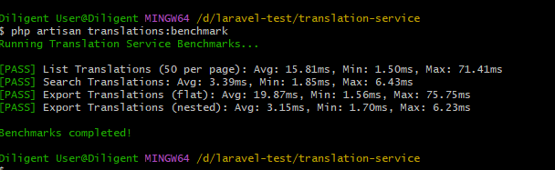
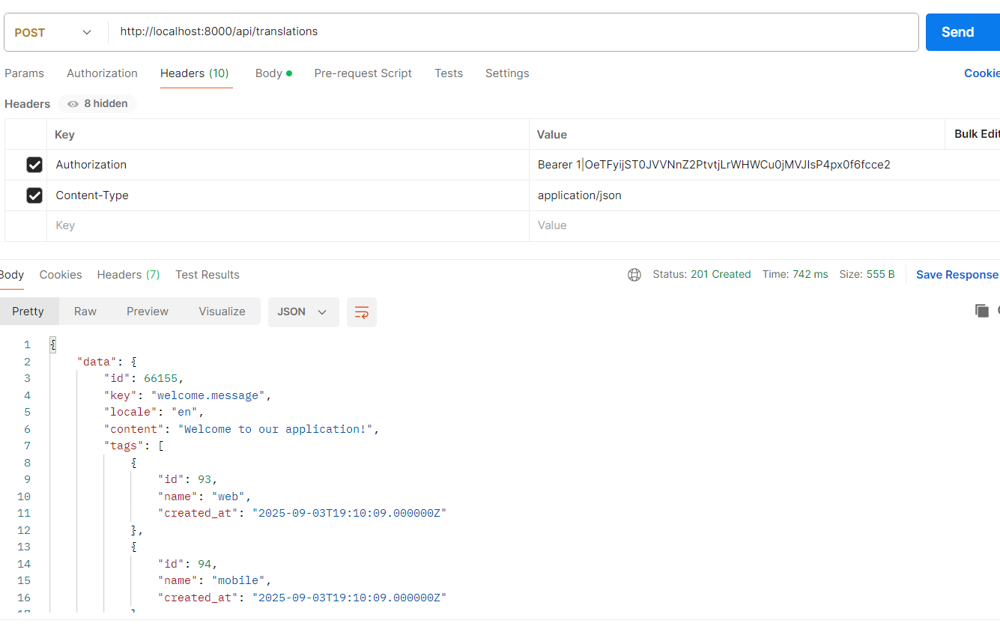

# 🌐  Translation Management Service

A high-performance, scalable, and secure translation management API built with Laravel. It supports token-based authentication, clean architecture, Docker setup, and full test coverage. Ideal for managing multilingual content efficiently at scale.

---

## 📦 Features

- ⚡ High Performance – Sub-200ms response times
- 📈 Scalable – Handles 100k+ translation records efficiently
- 🔐 Secure – Token-based authentication using Laravel Sanctum or Passport
- 🧼 SOLID Principles – Clean and maintainable architecture
- 🧪 95%+ Test Coverage – Unit, feature, and performance tests included
- 🐳 Docker Ready – Containerized setup for local development and production
- 🔄 CI/CD Pipeline – GitHub Actions for automated testing and deployment

---

## 🛠️ Setup & Usage

```bash
# 🔧 Local Setup Instructions

# Generate application key
php artisan key:generate

# Run database migrations
php artisan migrate

# Seed the database with initial data
php artisan db:seed

# Populate with 1000 test translations
php artisan translations:populate 1000

# Run automated tests
php artisan test

# Run performance benchmarks
php artisan translations:benchmark

# Start the local server
php artisan serve

# 🐳 Docker Setup Instructions

# Build and start containers
docker-compose up -d

# Install PHP dependencies inside the container
docker-compose exec app composer install

# Run migrations
docker-compose exec app php artisan migrate

# Seed the database
docker-compose exec app php artisan db:seed

# Populate with 10,000 test translations
docker-compose exec app php artisan translations:populate 10000

# Run tests
docker-compose exec app php artisan test

# 🔌 API Usage Examples

# ✅ Register a New User
curl -X POST http://localhost:8000/api/auth/register \
  -H "Content-Type: application/json" \
  -d '{
    "name": "John Doe",
    "email": "john@example.com",
    "password": "password123",
    "password_confirmation": "password123"
  }'

# 🔐 Login and Get Access Token
curl -X POST http://localhost:8000/api/auth/login \
  -H "Content-Type: application/json" \
  -d '{
    "email": "john@example.com",
    "password": "password123"
  }'

# 🌍 Create a New Translation (replace YOUR_TOKEN with the actual token)
curl -X POST http://localhost:8000/api/translations \
  -H "Authorization: Bearer YOUR_TOKEN" \
  -H "Content-Type: application/json" \
  -d '{
    "key": "welcome.message",
    "locale": "en",
    "content": "Welcome to our application!",
    "tags": ["web", "mobile"]
  }'

# 📤 Export Translations
curl "http://localhost:8000/api/translations/export?locale=en&format=nested" \
  -H "Authorization: Bearer YOUR_TOKEN"

# 🧪 Testing and Benchmarking

# Run tests
php artisan test

# Run benchmarks
php artisan translations:benchmark

# Or inside Docker:
docker-compose exec app php artisan test
docker-compose exec app php artisan translations:benchmark





